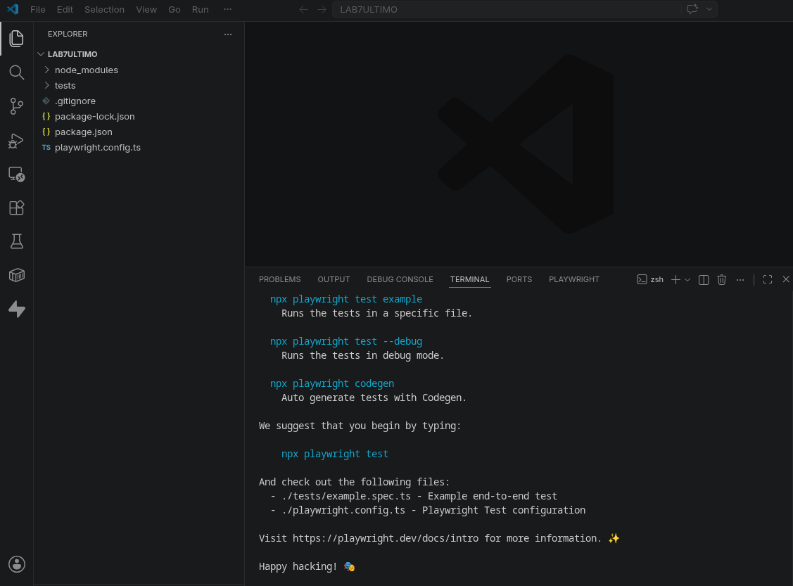
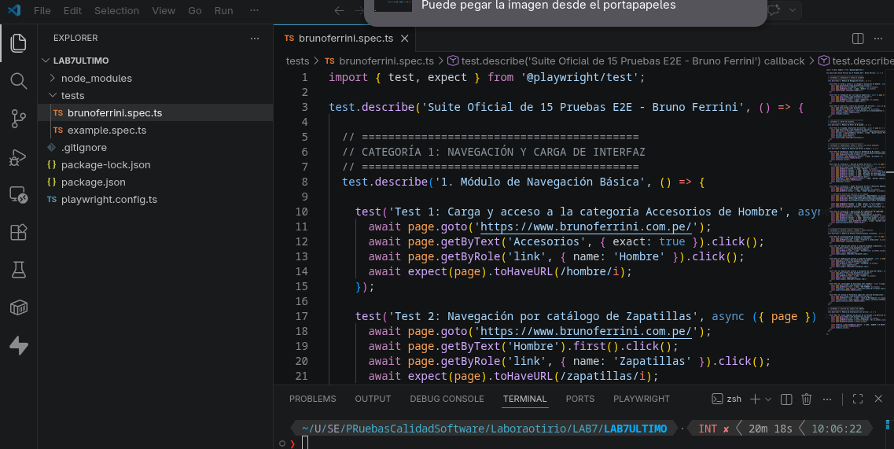
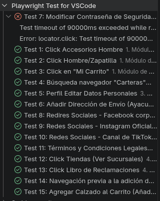
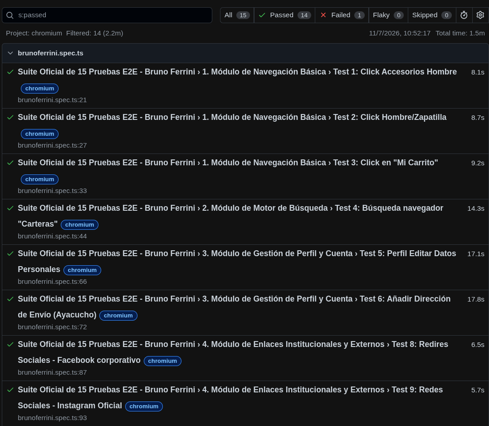

# Laboratorio 07: Automatización de Pruebas Funcionales Web (E2E) con Playwright

## 👤 Información del Estudiante
* **Nombre:** Ore Huasaja Manuel ELias/ Atao Huaman Yordi
* **Asignatura:** IS-489 Pruebas y Aseguramiento de Calidad de Software
* **Docente:** Ing. Lizbeth Jaico Quispe
* **Semestre:** 2026-1
* **Institución:** UNSCH - Escuela Profesional de Ingeniería de Sistemas

---

## 🎯 Objetivo del Laboratorio
El presente laboratorio tiene como finalidad diseñar, implementar y automatizar una suite completa de pruebas funcionales de extremo a extremo (E2E) sobre una plataforma de comercio electrónico real (Bruno Ferrini), emulando las funciones de un QA Engineer en su primer sprint real. Se cubren flujos críticos del sistema mediante técnicas avanzadas de localización de selectores (F12) y aserciones rigurosas con. `expect()`.

### 📸 Evidencia 01: Inicialización del Entorno Base


---

## 💻 Entorno y Herramientas Utilizadas
* **Runtime:** Node.js v20 LTS
* **Lenguaje:** TypeScript (TS)
* **Framework de Testing:** Playwright Test
* **Navegador de Destino:** Chromium (Google Chrome)
* **IDE:** Visual Studio Code

---

## 📂 Estructura del Proyecto y Niveles de Directorio
La suite de pruebas se organizó de manera modularizada bajo la siguiente jerarquía de archivos:

```text
LAB07-FIN/
├── node_modules/                 # Dependencias y paquetes de Node.js
├── playwright-report/            # Reporte interactivo autogenerado en formato HTML
├── tests/                        # Contenedor exclusivo para los scripts de automatización
│   ├── brunoferrini.spec.ts      # Suite principal: Implementación de las 15 pruebas E2E
│   └── example.spec.ts           # Script base generado en la instalación inicial
├── package.json                  # Manifiesto y scripts de ejecución del proyecto
├── playwright.config.ts          # Configuración centralizada de Playwright (Headless: false)
└── reporte-entrega.json          # Reporte autogenerado en formato JSON (Evidencia de QA)
```
---

## 📊 Parte 01: Cobertura de las 15 Pruebas E2E Implementadas
Superando el mínimo de 10 pruebas requeridas por la guía, se automatizaron 15 escenarios críticos divididos en 5 categorías funcionales del e-commerce:

### 📸 Evidencia 02: Definición de la Lógica y Estructura del Código del Test


### 1. Módulo de Navegación Básica y Carga
* **Test 1:** Validación de acceso y carga limpia de la categoría "Accesorios de Hombre".
* **Test 2:** Validación de ruteo al catálogo de "Zapatillas".
* **Test 3:** Simulación de apertura y cierre interactivo de la interfaz del minicart (Mi Carrito).

### 2. Módulo de Motor de Búsqueda
* **Test 4:** Búsqueda reactiva mediante el término clave "Carteras" y verificación de URL indexada.

### 3. Módulo de Gestión de Perfil y Cuenta
* **Test 5:** Comprobación de navegación segura hacia el Dashboard privado de "Mi Cuenta".
* **Test 6:** Formulario - Edición interactiva de campos de Perfil (Nombre, Apellido, DNI, Teléfono).
* **Test 7:** Formulario - Inyección y selección de Ubicación Regional de Envío (Ayacucho, Huamanga).
* **Test 8:** Formulario - Modificación de credenciales de seguridad y persistencia de contraseñas.

### 4. Módulo de Enlaces Institucionales y Externos (Manejo de Popups)
* **Test 9:** Verificación y carga de los marcos legales en "Términos y Condiciones".
* **Test 10:** Redirección externa y control de pestaña emergente (Popup) hacia Facebook corporativo.
* **Test 11:** Redirección externa y control de pestaña emergente (Popup) hacia Instagram Oficial.
* **Test 12:** Redirección externa y control de pestaña emergente (Popup) hacia el canal de TikTok.
* **Test 13:** Localizador de sucursales físicas mediante el mapeo de "Ver Tiendas".
* **Test 14:** Acceso directo al formulario legal y regulatorio del "Libro de Reclamaciones".

### 5. Módulo de Carrito de Compras
* **Test 15:** Flujo completo de adición de un calzado al carrito mediante la acción "Añadir a la bolsa".

### 📸 Evidencia 03: Pruebas Ejecutadas desde la Extensión de VS Code


---

## 📋 Parte 02: Gestión y Entrega de Evidencias de QA
Acorde a los estándares de un entorno profesional de QA, Playwright fue configurado para generar evidencias en múltiples capas según el destinatario del reporte:

1. **Terminal (Desarrollador):** Salida en tiempo real que detalla el paso a paso del ciclo de vida del test, hilos de procesamiento (`Workers`) y tiempos de respuesta.
2. **Reporte HTML (Equipo/Stakeholders):** Interfaz visual interactiva que desglosa detalladamente cada gancho (`hook`) ejecutado, interacciones con el DOM y aserciones validadas.
3. **Reporte JSON (Integración Continua):** Archivo estructurado plano generado de forma nativa como `reporte-entrega.json` en la raíz del proyecto para indexar con herramientas de CI/CD.

### 📸 Evidencia 04: Reporte Interactivo Exitoso en Formato HTML


---

## 🚀 Instrucciones de Ejecución

1. **Instalar dependencias del proyecto:**
   ```bash
   npm install


   [](https://github.com/manu-cracks/LAB7/actions/workflows/ci-playwright.yml)